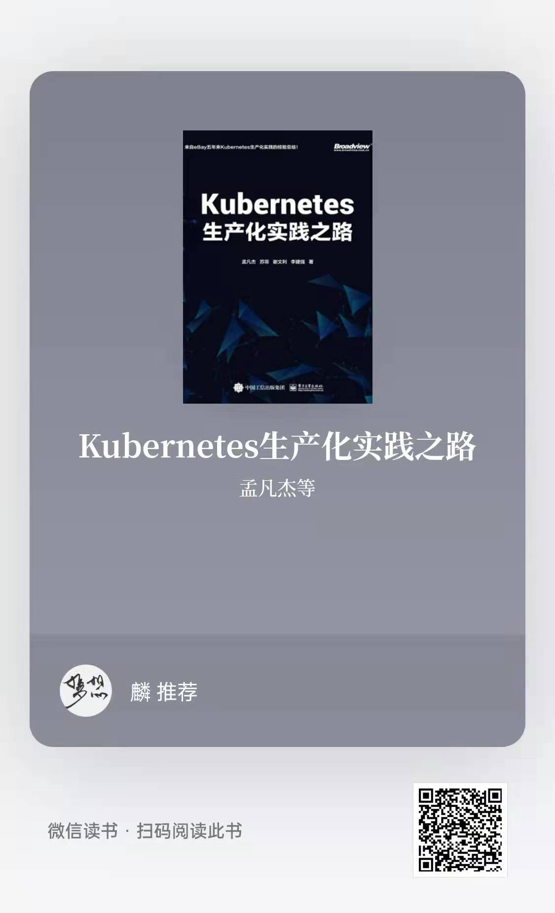

# Kubernetes 101

## What's 101 ?

101 (pronounced ONE-oh-ONE) is a slang term for the most basic knowledge in some subject, as in "boiling potatoes is cooking 101".

## Base

本Repo的内容将以《Kubernetes生产化实践之路》（孟凡杰、苏菲、谢文利、李建强 著）作为理论基调，提供对应内容的实践指南。

全部内容都会经过原作者孟凡杰的Review，内容质量有保障。

在实践每一个模块之前，都可以先去阅读《Kubernetes生产化实践之路》补充对应的理论知识。

另外，您也无需担心该书收费而无法阅读等情况。

**得益于微信读书的运营策略，您几乎可以在微信读书上面免费阅读该书。**

欢迎大家购买实体书支持一下作者。[京东购书](https://item.jd.com/13036516.html)

{ width=300 }

## A basic instruction for Kubernetes setup and understanding

| Module ID |                                     Module                                     |           Guide            |
| :-------: | :----------------------------------------------------------------------------: | :------------------------: |
|     -     |                           Install Kubernetes Cluster                           | [k8s-install](k8s-install/readme.md) |
|     3     |                             Docker Core Technology                             |     [module3](module3)     |
|     4     |              Kubernetes Architecture Principles and Object Design              |     [module4](module4)     |
|     5     |                    Kubernetes Control Plane Component: etcd                    |     [module5](module5)     |
|     6     |                 Kubernetes Control Plane Component: APIServer                  |     [module6](module6)     |
|     7     |          Kubernetes Control Plane Component: Scheduler and Controller          |     [module7](module7)     |
|     8     | Kubernetes Control Plane Component: Lifecycle Management and Service Discovery |     [module8](module8)     |
|     9     |                 Managing Production-ready Kubernetes Clusters                  |     [module9](module9)     |
|    10     |                      DevOps with Kubernetes in Production                      |    [module10](module10)    |
|    11     |                          Migrating apps to Kubernetes                          |    [module11](module11)    |
|    12     |                     Advanced Traffic Management with Istio                     |    [module11](module12)    |

## Network

[Network Step by Step](https://www.wolai.com/qRAsHHbnAJYESViqvJHSoo)
